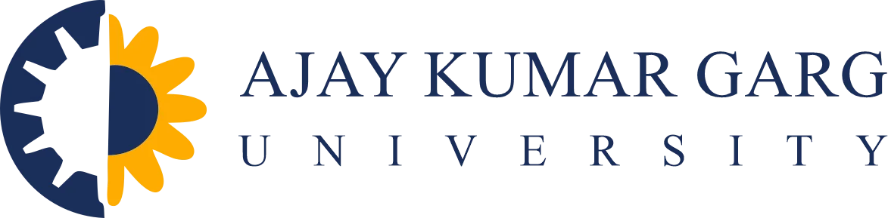
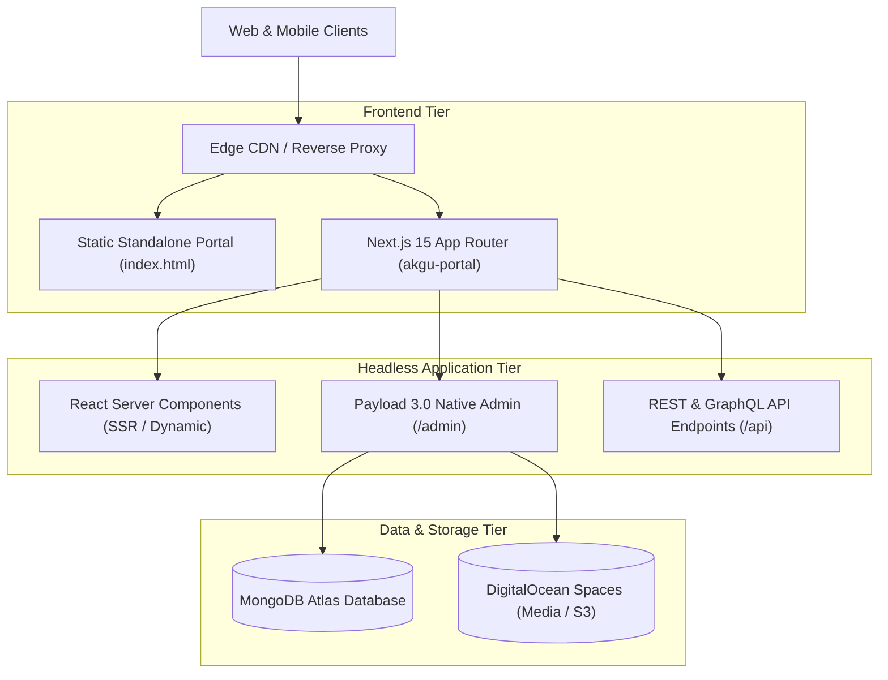

<div align="center">

  

  # Ajay Kumar Garg University (AKGU)
  ### Official Web Portal & Content Management System

  [](https://nextjs.org/)
  [](https://payloadcms.com/)
  [](https://www.typescriptlang.org/)
  [](https://tailwindcss.com/)
  [](#license)

  <p align="center">
    A modern, high-performance digital campus platform engineered for <strong>Ajay Kumar Garg University (AKGU)</strong>, Ghaziabad. Delivering an accessible, accessible-first portal for prospective students, faculty, researchers, recruiters, and statutory compliance.
  </p>

  <p align="center">
    <a href="#system-architecture">Architecture</a> •
    <a href="#repository-structure">Repository Structure</a> •
    <a href="#core-features">Features</a> •
    <a href="#tech-stack">Tech Stack</a> •
    <a href="#getting-started">Getting Started</a> •
    <a href="#deployment">Deployment</a> •
    <a href="#compliance--security">Compliance</a>
  </p>
</div>

---

## 🏛️ Overview

Founded on the 28-year academic legacy of **Ajay Kumar Garg Engineering College (AKGEC)**, AKG University represents a multi-disciplinary institution committed to Industry 4.0 education, high-impact research, and institutional innovation.

This repository hosts the official web ecosystem for AKGU, designed with a **dual-distribution architecture**:
1. **High-Performance Static Distribution (`/index.html`)**: A lightweight, CDN-optimised frontend bundle engineered for sub-second First Contentful Paint (FCP) and resilience during high-traffic admission counseling cycles.
2. **Enterprise Full-Stack CMS Portal (`/akgu-portal`)**: A Next.js 15 (App Router) and Payload CMS 3.0 headless infrastructure providing dynamic page composition, role-based content governance, and structured data for institutional stakeholders.

---

## 🏗️ System Architecture



---

## 📂 Repository Structure

The codebase is organized into modular directories separating static assets, frontend scripts, specification documents, and full-stack CMS services:

```text
AKGU/
├── index.html                   # Production-ready static standalone portal (Tailwind CSS, Lucide icons, ES6)
├── main.js                      # Core frontend interactive modules (modal controllers, sticky nav, mobile drawer)
├── styles.css                   # Custom theme tokens, font utilities, and institutional color system
├── akg-logo.webp                # Official high-resolution institution brandmark
├── favicon.png                  # University crest favicon
│
├── akgu-portal/                 # Full-stack Next.js 15 + Payload CMS 3.0 application
│   ├── src/
│   │   ├── app/                 # Next.js App Router (Layouts, Homepage, dynamic [...slug], 404, Admin)
│   │   ├── components/
│   │   │   ├── blocks/          # Page Builder components (Hero, Stats, Programs, Centres of Excellence, etc.)
│   │   │   ├── layout/          # Global Header, Footer, Announcement Banner, Mobile Drawer
│   │   │   ├── modals/          # Ctrl+K Global Search modal, Admission Enquiry dialog
│   │   │   └── ui/              # Button, Card, Badge, and input primitives
│   │   ├── lib/                 # Database seed scripts, block rendering engine, formatters
│   │   └── payload/
│   │       ├── blocks/          # Payload block schema definitions (HeroBlock, StatsBlock, etc.)
│   │       ├── collections/     # Data collections (Pages, Programs, Departments, Faculty, Placements, etc.)
│   │       ├── globals/         # Global models (SiteSettings, Header navigation, Footer compliance)
│   │       └── payload.config.ts# Payload CMS configuration with MongoDB adapter and lexical editor
│   ├── public/                  # Public assets, brand icons, and static web manifests
│   ├── package.json             # NPM dependencies, scripts, and build configurations
│   ├── tailwind.config.ts       # Institutional theme configuration (Navy, Amber, Slate tokens)
│   └── tsconfig.json            # TypeScript configuration
│
└── .kiro/                       # System engineering blueprints and task specifications
    └── specs/akgu-university-portal/
        ├── requirements.md      # Functional & technical compliance matrix
        ├── design.md            # UX guidelines, typography, and schema architecture
        └── tasks.md             # Development roadmap and milestone logs
```

---

## ✨ Core Modules & Institutional Features

### 1. Specialized Academic Schools
Showcases the university's degree programs across 6 specialized schools:
- **School of Computer Science & Engineering** (B.Tech CSE, AI/ML, Data Science, Cybersecurity)
- **School of Engineering Sciences** (Mechanical, Civil, ECE, Electrical & Computer Engineering)
- **School of Computing & Technology** (BCA, MCA, Cloud & Systems)
- **School of Management Studies** (BBA, MBA with FinTech & Analytics focus)
- **School of Artificial Intelligence** (Applied Machine Intelligence, Deep Learning & Robotics)
- **School of Doctoral Studies & Research** (Ph.D. research fellowships under UGC/AICTE norms)

### 2. World-Class Research & Industry Centres of Excellence
Details state-of-the-art laboratory infrastructure established in collaboration with global industrial leaders:
- **KUKA Industrial Robotics Centre**: Hands-on training on 6-axis articulated industrial robotic arms.
- **Siemens PLM & Bosch Rexroth Automation Lab**: Industrial automation, hydraulics, and Industry 4.0 testbeds.
- **3D Printing & Additive Manufacturing Centre**: SLA/FDM rapid prototyping and product development.
- **National Instruments (NI) Innovation Lab**: Virtual instrumentation and LabVIEW embedded control systems.
- **AICTE IDEA Lab**: Interdisciplinary maker space supporting student startup prototyping.

### 3. Placements & Corporate Relations
Verified student career achievements with enterprise recruiters:
- **Highest International Package**: ₹ 1.13 Crore / annum
- **Tier-1 Offers**: 62 Fortune Global 500 & 82 Fortune India 500 recruiters
- **Top Recruiters**: Goldman Sachs, Amazon, Microsoft, TCS, Infosys, Cognizant, Wipro, Capgemini
- Alumni feature cards detailing package offers, graduation year, and recruitment partners.

### 4. Interactive UX & Accessibility
- **Global Search (<kbd>Ctrl</kbd> / <kbd>Cmd</kbd> + <kbd>K</kbd>)**: Instant fuzzy-matched keyboard search covering schools, laboratories, faculty, and application deadlines.
- **Dynamic Hero Carousel**: Multi-slide campus highlights with accessible screen-reader indicators and pause-on-hover controls.
- **Admission Enquiry Modal**: Lead generation pipeline with form validation for prospective applicants.
- **Responsive Drawer**: Mobile-first touch-friendly slideout menu with multi-level accordion navigation.

---

## 🛠️ Tech Stack

| Domain | Technology | Purpose |
|---|---|---|
| **Frontend Framework** | [Next.js 15](https://nextjs.org/) (App Router) | On-demand dynamic rendering, SSR, edge routing |
| **CMS Engine** | [Payload CMS 3.0](https://payloadcms.com/) | Native Next.js App Router headless CMS & editorial panel |
| **Language** | [TypeScript 5.6](https://www.typescriptlang.org/) | Strict type safety across collections, globals, and UI blocks |
| **Database** | [MongoDB](https://www.mongodb.com/) (Mongoose / Atlas) | Document store for collections, media metadata, and revisions |
| **Styling** | [Tailwind CSS 3.4](https://tailwindcss.com/) | Responsive utility-first design system with custom brand palette |
| **Icons** | [Lucide Icons](https://lucide.dev/) | Clean, accessible vector UI icons |
| **Static Engine** | Vanilla ES6+ & HTML5 | Standalone, dependency-free landing page distribution |

---

## 🚀 Getting Started

### Prerequisites
- **Node.js**: `v20.x` or higher
- **Package Manager**: `npm` (v10+)
- **Database**: Local MongoDB instance or MongoDB Atlas connection URI

### 1. Repository Setup
```bash
# Clone the repository
git clone https://github.com/mohit4215/akgu.git
cd akgu
```

### 2. Standalone Frontend (`index.html`)
To inspect the standalone static distribution:
```bash
# Using python built-in server
python -m http.server 8080

# Or using npx serve
npx serve .
```
Visit `http://localhost:8080` in your browser.

### 3. Full-Stack CMS Portal (`akgu-portal`)
```bash
cd akgu-portal

# Install dependencies
npm install

# Setup environment variables
cp .env.example .env.local
```

Configure your `.env.local`:
```env
DATABASE_URI=mongodb://127.0.0.1:27017/akgu
PAYLOAD_SECRET=your-random-32-character-secret-key-here
NEXT_PUBLIC_SERVER_URL=http://localhost:3000
```

Run the development server:
```bash
npm run dev
```

Open:
- **Public Portal**: [http://localhost:3000](http://localhost:3000)
- **Payload Admin Panel**: [http://localhost:3000/admin](http://localhost:3000/admin)

To seed initial campus data (schools, faculty, recruiters, settings):
```bash
npm run seed
```

---

## 📦 Production Build

To build the full-stack Next.js 15 + Payload CMS application for production:

```bash
cd akgu-portal
npm run build
npm run start
```

---

## 🛡️ Statutory Compliance & Governance

The platform adheres to Indian regulatory mandates for higher education institutions:
- **Anti-Ragging Compliance**: National Toll-Free Helpline `1800-180-5522` prominently displayed alongside institutional grievance redressal contacts.
- **Accreditation Disclosures**: AICTE approvals, UGC university charter notifications, and NIRF / NAAC submission data access.
- **Security & Privacy**: Client-side data minimization, sanitized form inputs, and strict Content Security Policy (CSP) headers.

---

## 📄 License & Intellectual Property

Copyright © 2026 **Ajay Kumar Garg University (AKGU)**. All rights reserved.  
All brand assets, institutional crests, campus photography, and curriculum details are proprietary to AKGU.
